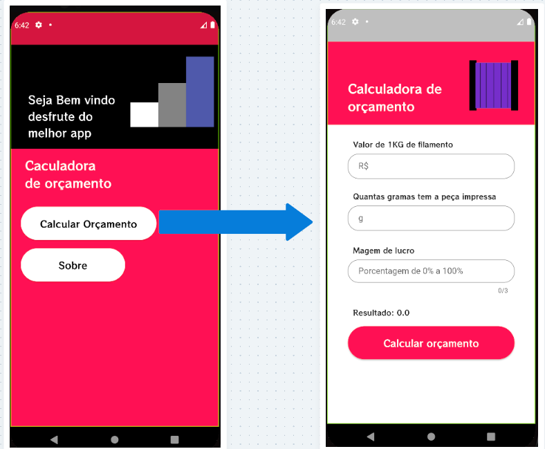
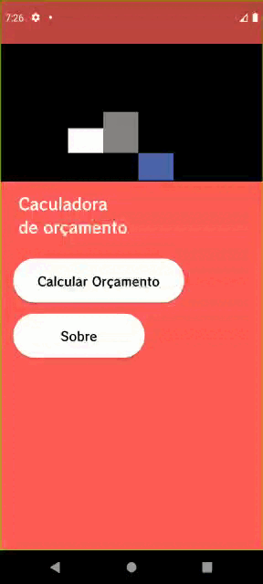
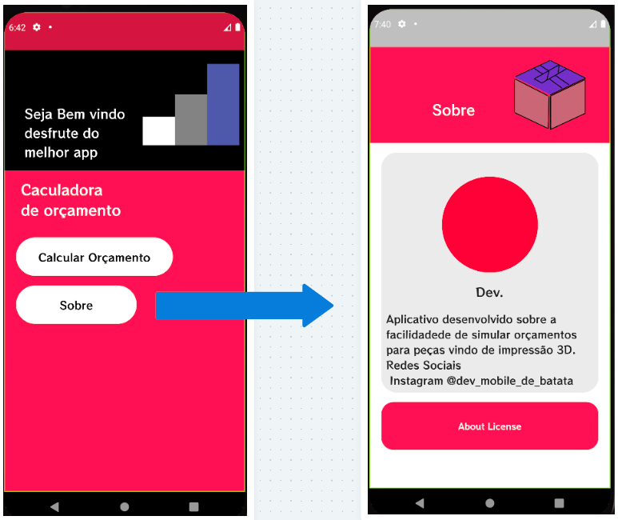
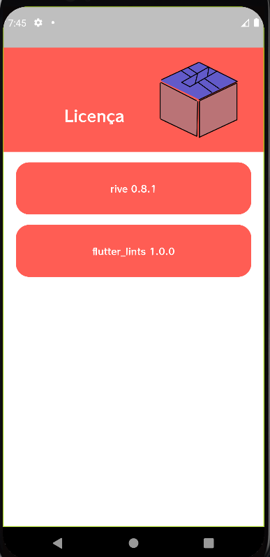

# Projeto de estudo 

## Ferramentas Ultilizadas
#
*  Linguagem Flutter Dart
*  Layout de telas em figma
*  Design readme canva
#
# Calculadora_de_filamento_screen

Aplicativo simples para calcular valores teoricos sobre peças feitas na impressora 3D

#
### Pages
   Tela apresenta a parte principal do aplicativo que diz a calculadora 
   pagina inicial ==>> pagina da calculadora 
## Simples Animação da tela inicial   

#### Animação apresentada feita com plugins Rive , Otimo para uso simples aplicação 
#
## Objetivo
   Conseguir desenvolver uma aplicação para simplificar o processo de calculo rapido 
   para pessoas que querem dá uma consultada rapida no valor teorico da peça impressa
   na impressora 3d
#
## Pagina Sobre 

#### Apresenta simplificademnte dados da licença de plugins utilizados para uso de tais 
## Pagina que apresenta as licenças 
#

## Participantes
#

*   Marco Antonio

#
## 🚧 Em andamento 🚧

